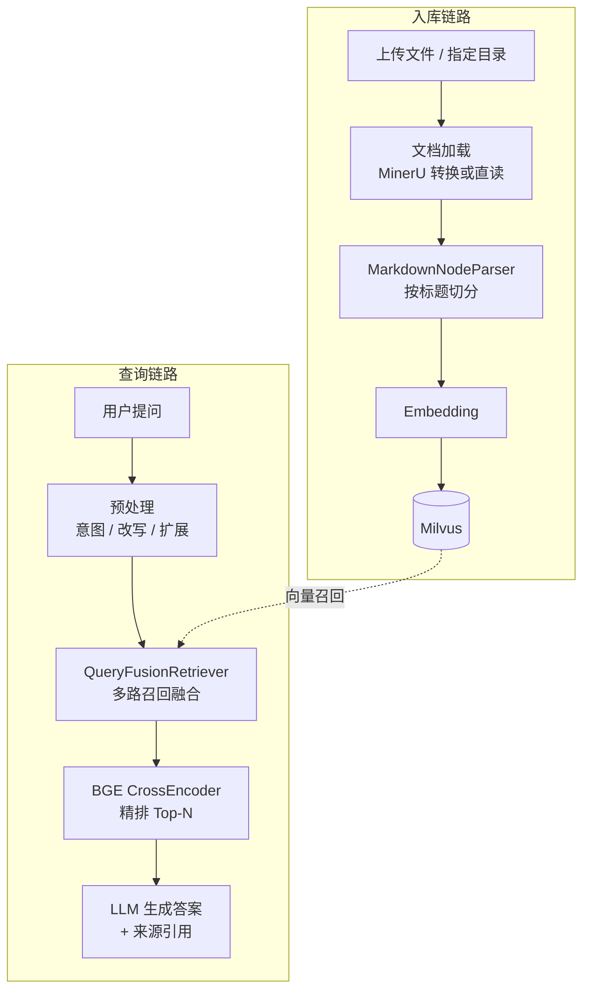

# Agentic-RAG-demo

基于 **FastAPI + llama-index + Milvus** 的个人知识库问答服务:上传 PDF / Markdown / Word / PPT 等文档,即可通过网页或 API 进行有据可查的问答 —— 答案只基于库内资料,并附来源引用。

核心特点:

- **五段式 RAG 流水线**:查询预处理(意图识别 → 指代改写 → 查询扩展)→ 多路融合召回 → BGE 精排 → 生成,多轮对话自动补全指代
- **双供应商可切换**:LLM 与 Embedding 均支持 MiniMax / 智谱 GLM,改 `.env` 即可切换,无需改代码
- **LLM 双档位**:生成走高质量档,意图 / 改写 / 扩展等轻任务走免费快速档,控成本
- **MinerU 解析通道(可选)**:PDF / DOCX / PPTX 先转 Markdown 落盘,人工检查质量后再入库
- **入库幂等**:同名文件自动跳过,不重复消耗 embedding 费用

## 架构



| 模块 | 位置 | 职责 |
|------|------|------|
| 配置中心 | `app/core/config.py` | 读取 `.env`,快速失败 |
| LLM 客户端 | `app/core/llm.py` | OpenAI 兼容协议,剥离 `<think>` 推理块 |
| Embedding 适配 | `app/core/embedding.py` | MiniMax / 智谱双实现,统一入口 |
| Milvus 封装 | `app/core/milvus_client.py` | 建库、查重、来源统计 |
| RAG 流水线 | `app/rag/` | loader → splitter → indexer → pre_query → retriever → post → generator |
| API 路由 | `app/api/` | 上传入库、问答 |
| 前端 | `static/index.html` | 单页界面(上传 + 对话) |

## 快速开始

### 前置要求

- Python 3.11(推荐 conda 管理环境)
- 一个运行中的 [Milvus](https://milvus.io)(默认 `http://localhost:19530`,可用 Docker 单机版)
- MiniMax 或 智谱 GLM 的 API Key

### 1. 安装依赖

本仓库未附带依赖清单,依赖装在 conda 环境 `rag` 中。核心依赖如下,可按需安装:

```bash
conda create -n rag python=3.11 -y
conda run -n rag pip install fastapi "uvicorn[standard]" llama-index llama-index-llms-openai-like \
  llama-index-vector-stores-milvus llama-index-readers-file pymilvus \
  sentence-transformers python-dotenv requests
```

> 首次问答时会自动从 HuggingFace 下载 `BAAI/bge-reranker-v2-m3` 重排模型(约 2 GB)。

### 2. 配置 `.env`

在项目根目录创建 `.env`(必填:`MINIMAX_API_KEY`、`MINIMAX_GROUP_ID`;若用智谱则配 `GLM_API_KEY` 并切换 provider),完整配置项见下文[配置说明](#配置说明)。

```bash
# ===== 最小可跑示例(MiniMax 全家桶)=====
MINIMAX_API_KEY=你的key
MINIMAX_GROUP_ID=你的groupid

# ===== 或:智谱 GLM =====
# LLM_PROVIDER=glm
# EMBEDDING_PROVIDER=glm
# GLM_API_KEY=你的key
```

### 3. 启动

```bash
conda run -n rag uvicorn main:app --host 127.0.0.1 --port 8000 --reload
```

打开 http://127.0.0.1:8000 即可使用网页;上传文档 → 提问。

## 使用

### 网页

首页即交互界面:侧边栏展示已入库文件,拖拽上传自动入库,对话框支持多轮追问。

### API

| 方法 | 路径 | 说明 |
|------|------|------|
| POST | `/upload/files` | multipart 上传文件并入库,`convert_only=true` 时仅转 Markdown 不入库 |
| POST | `/upload/dir` | JSON `{"path": "/path/to/dir"}`,入库服务器上的目录 |
| GET | `/upload/files` | 列出已入库文件及各自 chunk 数 |
| POST | `/chat` | 提问,`{"question": "...", "history": [...]}`,返回答案 + 来源 + 调试 meta |

```bash
# 上传并入库
curl -X POST http://127.0.0.1:8000/upload/files -F "files=@./doc.pdf"

# 提问
curl -X POST http://127.0.0.1:8000/chat \
  -H "Content-Type: application/json" \
  -d '{"question": "文档里讲了什么?"}'
```

响应示例:

```json
{
  "answer": "……(1)",
  "sources": [
    {"index": 1, "content": "片段预览……", "score": 0.95, "source": "doc.pdf"}
  ],
  "meta": {"intent": "factual", "rewritten": "…", "expanded": ["…"], "raw_count": 10, "after_count": 5}
}
```

## 配置说明

所有配置均在项目根 `.env`,缺必填项时启动即报错(快速失败)。

| 变量 | 默认值 | 说明 |
|------|--------|------|
| `LLM_PROVIDER` | `minimax` | 对话模型供应商:`minimax` / `glm` |
| `MINIMAX_API_KEY` | **必填** | MiniMax API Key |
| `MINIMAX_GROUP_ID` | **必填** | MiniMax GroupId(embedding 接口强制要求) |
| `LLM_MODEL` | `MiniMax-M3` | MiniMax 对话模型 |
| `GLM_API_KEY` | — | `LLM_PROVIDER=glm` 时必填 |
| `GLM_MODEL` | `glm-5.3-flash` | 生成档模型 |
| `GLM_FAST_MODEL` | `glm-4.7-flash` | 预处理档模型(免费) |
| `EMBEDDING_PROVIDER` | `minimax` | 向量模型供应商:`minimax` / `glm` |
| `EMBEDDING_MODEL` | `embo-01` / `embedding-3` | 随 provider 自动取默认 |
| `EMBEDDING_DIM` | `1536` / `1024` | 向量维度,随 provider 自动取默认 |
| `MILVUS_URI` | `http://localhost:19530` | Milvus 地址 |
| `MILVUS_DB` / `MILVUS_COLLECTION` | `rag_kb` / `personal_kb` | 库名 / 集合名 |
| `TOP_K` / `RERANK_TOP_N` | `10` / `5` | 召回数 / 精排保留数 |
| `SIMILARITY_CUTOFF` | `2.0` | Milvus COSINE distance 上限(`2.0` = 全放行) |
| `MINERU_ENABLED` | `false` | 是否启用 MinerU 解析 PDF/DOCX/PPTX |
| `MINERU_BIN` | `/opt/anaconda3/envs/rag/bin/mineru` | mineru 可执行文件路径 |
| `MINERU_OUTDIR` | `converted` | 转换产物目录 |
| `HOST` / `PORT` | `127.0.0.1` / `8000` | 服务监听地址 |
| `UPLOAD_DIR` / `MAX_UPLOAD_MB` | `uploads` / `50` | 上传目录 / 单文件大小上限 |

## 注意事项

- **切换 `EMBEDDING_PROVIDER` = 更换向量空间**:必须清空 Milvus collection 并重新入库,否则检索结果不可信
- **同名文件不会重新入库**:修改文件内容后想更新索引,请改名重传或清空 collection
- MiniMax embo-01 的入库与检索使用不同编码空间(`type=db` / `type=query`),由代码自动区分,混用会导致召回率暴跌
- 问答为一次性返回(非流式);预处理与生成的 LLM 输出中的 `<think>` 推理块已自动剥离
